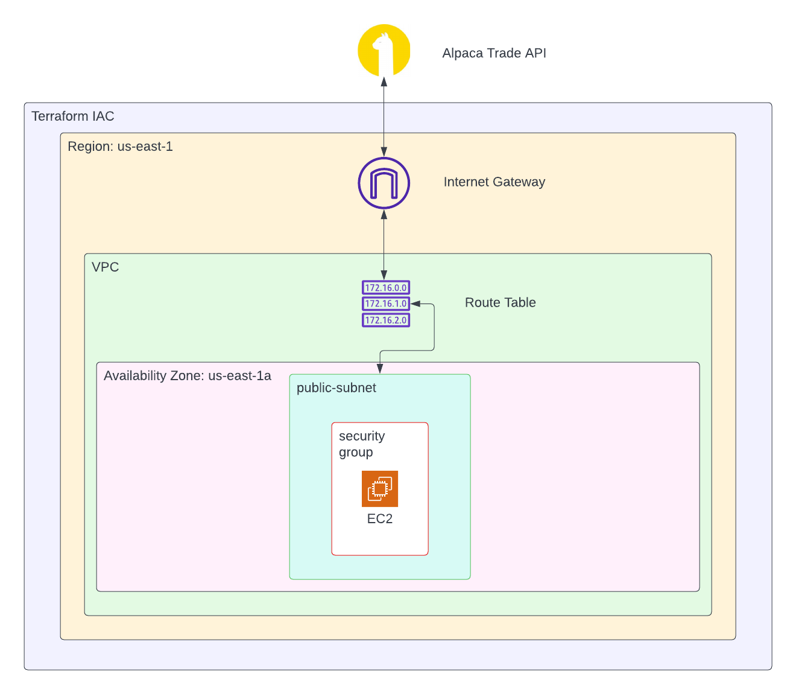

[](https://github.com/dylanzenner/stock-rl/actions/workflows/terraform-up.yml) [](https://github.com/dylanzenner/stock-rl/actions/workflows/terraform-down.yml)

# stock-rl
This repo contains our project for CPE 800

# About
Smart Trader is an automated trading bot utilizing Reinforcement Learning to make live trades using the Alpaca Trade API. You can choose between 4 individual algorithms to use: A2C, PPO, TD3, and DDPG. Or you can use an Ensemble of A2C, PPO, and TD3. 

Smart Trader automatically traines the agents you specify daily so there is no need to worry about when you will have to retrain the agents, you will always have the most up to date agents to use for your bot.



# Steps for Replication

- <details>
    <summary style="font-size:larger;">Step 1: Obtain Alpaca Markets API Keys</summary>
    <br>
    - Obtain API keys here: https://alpaca.markets/
    <br>
    &nbsp;&nbsp;&nbsp;&nbsp;

    <br>
    - Upload api keys to AWS Secrets Manager
    <br>
    &nbsp;&nbsp;&nbsp;&nbsp;

  
    </details>
  <br>

 - <details>
    <summary style="font-size:larger;">Step 2: Create an S3 Bucket & change source code</summary>
    <br>
    Before you can run Smart Trader you will need to create an S3 bucket which will be used to house the "src" directory. So create a bucket and upload the "src" directory after making the following changes to the main.py file:

    - line 29:
      - Replace 
        ```python
        return api_key["api_key"]
        ``` 

        with:

        ```python
        return api_key["the name of your api key stored in secrets manager"]```

    - line 32:
      - Replace 
        ```python
          return api_secret["api_secret"]
        ``` 

        with:
        
        ```python
        return api_key["the name of your api secret key stored in secrets manager"]
        ```

    - line 316 & 317:
      - Replace 
        ```python
        alpaca_key = retrieve_secret("alpaca_keys", id="api_key")

        alpaca_secret = retrieve_secret("alpaca_keys", secret="api_secret")
        
        ``` 

        with:
        
        ```python
        alpaca_key = retrieve_secret("name of your stored keys", id="name of your stored alpaca key id")

        alpaca_secret = retrieve_secret("name of your stored keys", secret="name of your stored alpaca secret key")
        
        ``` 

    - line 360:
      - Add up to 30 different equity symbols to trade


    <br>
  </details>

<br>


 - <details>
    <summary style="font-size:larger;">Step 3: Set up AWS Infrastructure</summary>
    <br>
    The infrastructure for this project is contained in the <strong><font color=#0fb503>main.tf</font></strong> file. You can change this file to fit your specific architetcture needs but, if you just want to deploy the project for yourself there are some changes you will have to make. Those changes are as follows:
    <br>
    &nbsp;&nbsp;&nbsp;&nbsp;

    - Uncomment lines 93 - 99.
    <br>
    &nbsp;&nbsp;&nbsp;&nbsp;

    - Add your IP address to line 98
    <br>
    &nbsp;&nbsp;&nbsp;&nbsp;
    
    - Create your own key pair in AWS and replace the   
      keypair name on line 139 with the name of the 
      keypair you just created

    - Replace line 180 in main.tf with: 
  
      ```bash
      sudo aws s3 cp s3://your-s3-bucket-name-here/src /usr/bin/bot/ --recursive
      ```
    

    </details>

<br>

 - <details>
    <summary style="font-size:larger;">Step 4: Set up CICD Pipeline</summary>
    <br>
    For this project a CICD pipeline is set up to automatically deploy and teardown the AWS infrastructure based on when the stock market opens and closes. Below are the steps to set up the CICD pipeline:
    <br>
    &nbsp;&nbsp;&nbsp;&nbsp;

    - You can follow the steps outlined [here](https://learn.hashicorp.com/tutorials/terraform/github-actions?in=terraform/automation) and tailor it to your needs. 
 
      
    </details>

<br>

 - <details>
    <summary style="font-size:larger;">Step 5: See your Trader in Action</summary>
    <br>
    To visualize how your trader is doing you can log in to your Alpaca Markets account and head on over to the paper trading section.
    <br>

    </details>

# Warning
*THIS IS NOT FINANCIAL ADVICE (DO NOT USE THIS BOT WITH REAL MONEY)*

At no point do the maintainers of this repo suggest to utilize this bot with real money. While reinforcement learning can solve a lot of neat problems particularly with the stock market, you have to remember all the academic papers you read talk nothing about using their trained agents on live data. If thier trained agents actually worked they would not publish it in these academic journals.